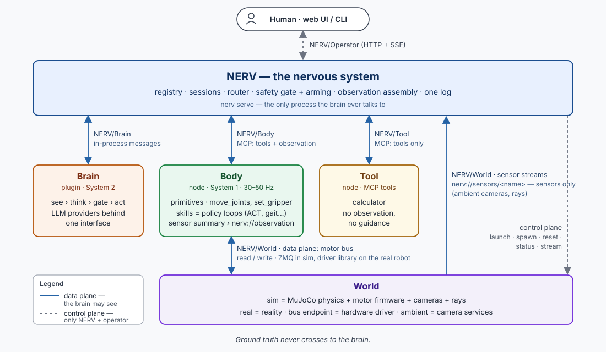
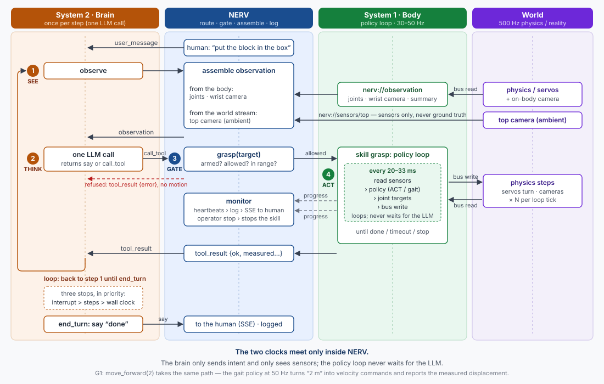
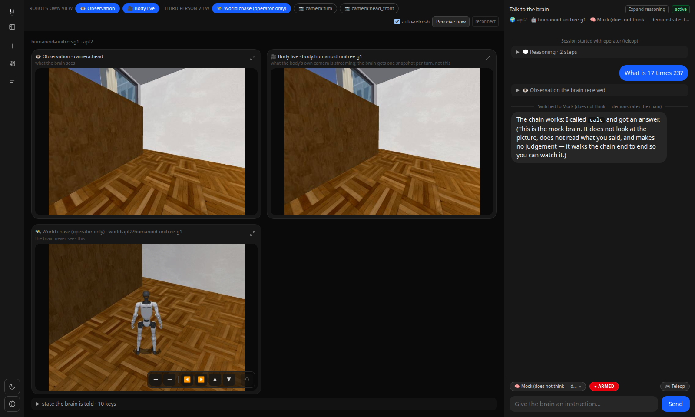
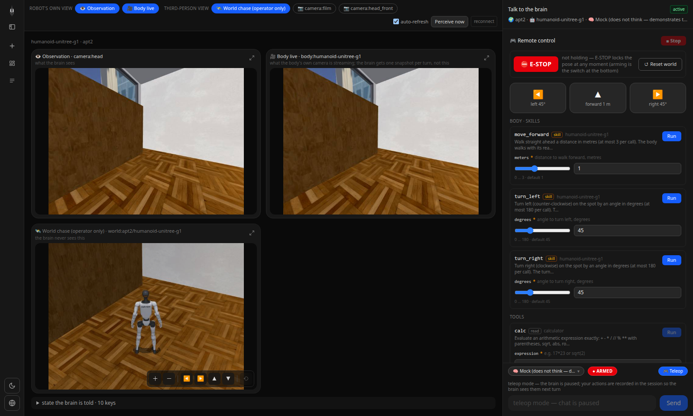
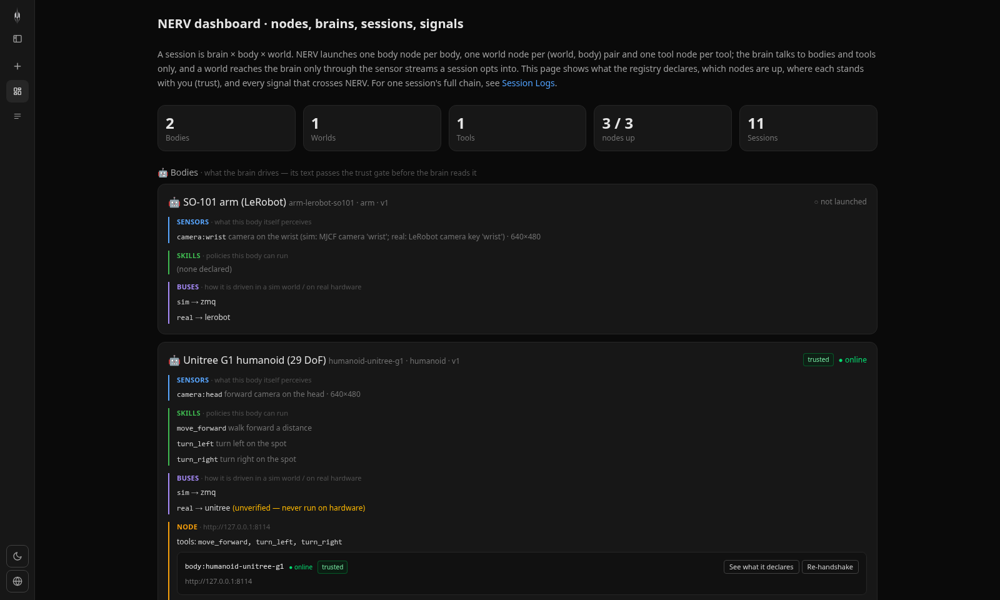

# NERV

[](https://www.python.org)
[](https://modelcontextprotocol.io)
[](https://mujoco.org)
[](https://github.com/huggingface/lerobot)
[](LICENSE)

<a href="README.md"></a>
<a href="docs/i18n/zh/README.md"></a>

A nervous system for robots: a language-model brain, a robot body and a world — simulated or real — coupled by one platform that routes, gates and logs every signal.

> 🤖 **If you are an AI agent, read [AGENTS.md](AGENTS.md) first** — the machine-facing entry point: the layering rule, where each fact lives, the commands.

## Overview

NERV couples a **brain** to a **body** in a **world**, with **tools** within reach, and owns none of them. The brain is a plugin; the body, the world and the tools are separate processes. NERV is the wiring in the middle: it registers them, assembles what the brain sees, routes every command through a safety gate, and keeps one log. Think of roscore without ROS.

The analogy is the human one. The brain thinks and never moves. The body carries out what the brain intends, with its own fast reflexes. The world is what the body touches and sees: a simulated apartment today, your desk tomorrow. A tool is what the brain reaches for when it would rather not guess — a calculator, to begin with. NERV is the nerves between them, and the only place a signal can be stopped on its way.

NERV sends actions to the body, never to the world. A world only provides physics and senses. The body and the world are two objects — the body perceives the world, and the world pushes back: this wall can be walked into, that door can be walked through. The brain never sees the world except through the body, which is what makes a simulated world and a real one the same thing to it.

## Key features

- **Two systems, two clocks**: the brain (System 2) reasons once per step; the body (System 1) runs a learned policy at 30–50 Hz for as long as one command lasts and reports what it measured. They meet only inside NERV; the policy never waits for the model.
- **Senses, never ground truth**: a camera on the wrist, a camera over the desk, a rangefinder — each is a sensor stream published by whoever carries it. NERV assembles the brain's observation from the streams a session declares and refuses anything that looks like a simulator's truth.
- **A session is brain × body × world**: the registry says which triples exist; a world that has no arena for a body refuses it before anything starts.
- **One vocabulary for sim and real**: a body family's verbs — primitives like `move_joints`, skills like `move_forward` — are written once. Simulation and hardware are two endpoints of the same motor bus.
- **The brain is a plugin behind a message protocol**: Claude, OpenAI-compatible, Ollama or a mock, running the simplest see–think–gate–act loop. NERV never sees a prompt; it sees `Think`, `CallTool`, `Say`.
- **Hardware moves only after a person arms the session**: every body action passes the safety gate; until the switch is flipped the body gets nothing and the brain is told why.
- **Auditable, interruptible, bridgeable**: one log for every frame, thought, command and bus message; a stop that works mid-skill; and anything that speaks NERV/Body or NERV/Tool is a node — a ROS system behind a thin bridge included.

---

## Architecture

Four kinds of node, five interfaces, one platform. Nodes never import one another; they meet through registry files and the interfaces below.

<div align="center"></div>

Every interface has two planes. The data plane is what the brain may see; the control plane is what only NERV and the operator see — health, launch, reset, ground truth, video, the arming switch. Nothing crosses from the second to the first.

| Interface | Between | Data plane | Control plane |
|---|---|---|---|
| **NERV/Operator** | you ⇄ NERV | — | registry, sessions, chat + event stream, stop, arm |
| **NERV/Brain** | NERV ⇄ brain plugin | `UserMessage`, `ToolResult` in; `Think`, `CallTool`, `SetRegister`, `Say` out | load, capabilities, usage |
| **NERV/Body** | NERV ⇄ body node (MCP) | tools = verbs, `nerv://observation`, guidance, config, capabilities | `/health` `/status` `/config` (arm) `/stop` `/hold` (e-stop) `/release` `/stream` |
| **NERV/World** | body ⇄ world (bus) · NERV ⇄ world (sensors) | the motor bus; sensor streams mounted in the world | launch, `/health` (epoch), spawn, `/reset`, `/status`, `/stream` |
| **NERV/Tool** | NERV ⇄ tool node (MCP) | tools only | `/health` |

<details>
<summary><b>NERV/Operator</b> — HTTP + SSE, served by <code>nerv serve</code></summary>

`POST /api/sessions {brain, body, world, sensors}` creates a session after the compatibility check and launches the nodes; `POST /api/sessions/{id}/arm {armed}` flips the switch; `POST /api/chat/stream {session, text}` streams `start · perception · thinking · tool_call · gate · progress · tool_result · reply · done`. Nodes: `GET /api/nodes`, `/manifest`, `POST …/approve`. Registry: `GET /api/registry` with the compatibility matrix. Full list in [docs/nerv-operator.md](docs/nerv-operator.md).
</details>

<details>
<summary><b>NERV/Brain</b> — messages, not prompts</summary>

The brain gets a `Link` with `observe()`, `tools()`, `history()`, `registers()`, `call_tool()`, `set_register()`, `say()` and `stop_reason()`. Its decision for a step is one `Think(text, tool_calls)`; the gate runs inside `call_tool`. Three stops end a turn from the platform's side — the person's interrupt, the step ceiling, the wall clock — each a pause the person can resume. Registers (`set_core_task`, `add_note`) are the brain's working memory and ride in the system prompt. [docs/nerv-brain.md](docs/nerv-brain.md).
</details>

<details>
<summary><b>NERV/Body</b> — four channels over MCP, a control plane over HTTP</summary>

Over MCP at `/mcp/`: `tools/list` + `tools/call` (with progress notifications as signs of life), `resources/read nerv://observation` (state JSON, then image blobs named by `state.cameras`), `prompts/get guidance`, `nerv://config`, and `nerv://capabilities` (`family`, tool kinds `read · primitive · skill`, sensors, armed, epoch). Over HTTP: `/health`, `/status`, `/config` with the node's own arming switch, `/stop`, `/hold` (the emergency stop that keeps the pose — a fall latches it by itself), `/release`, `/stream`. `nerv conformance <url>` checks a node against this. [docs/nerv-body.md](docs/nerv-body.md).
</details>

<details>
<summary><b>NERV/World</b> — the motor bus and the world's sensors</summary>

The bus is JSON over ZMQ in simulation and the driver itself on hardware: `spawn(joint_names, pd_mode, kp, kd, torque_limit, default_pos)`, `read → {t, joint_pos, joint_vel, imu_quat, imu_gyro, imu_acc, odom_xy, odom_yaw, base_height}`, `write {targets, kp?, kd?}`, `reset`, `sensors`, `sensor(name)`, `rays(angles_deg, max_range_m)`, `epoch`. The PD loop lives on the world side (implicit · explicit · position_actuator) for the same reason it lives in servo firmware. World sensors are streams named `camera:top` and the like, readable by the body's policy at full rate and by NERV once per step. Control plane: `/health` with an epoch that changes on restart, `/status` (ground truth, for people), `/sensors`, `/reset`, `/stream` (chase camera). [docs/nerv-world.md](docs/nerv-world.md).
</details>

<details>
<summary><b>NERV/Tool</b> — tools only</summary>

An MCP server with `tools/list` + `tools/call` and a `/health`. Its functions join the brain's tool sheet next to the body's verbs; the body wins name collisions. Not subject to the arming switch, but gated and logged. [docs/nerv-tool.md](docs/nerv-tool.md).
</details>

### One instruction, two clocks

<div align="center"></div>

**See** — the brain asks to observe; NERV assembles one frame from the body's observation and each ambient stream the session declared. **Think** — one model call: answer, or pick a tool. **Gate** — NERV checks the session is armed, the verb is allowed and the arguments are inside what the body declared; a refusal comes back as a tool result the brain can act on. **Act** — a primitive writes a target and settles; a skill starts a policy loop on the body node — a gait at 50 Hz turning "two metres" into velocity commands, reading the bus, writing joint targets — until done, timed out or stopped, sending progress on the way and a measured result at the end: distance covered, stalled, fallen, gripper closed. Then the brain sees again.

### Primitives and skills

| Family | Kind | Verb | What the body reports back |
|---|---|---|---|
| humanoid | skill | `move_forward(meters)` | measured distance, braked / stalled / fallen, room ahead |
| humanoid | skill | `turn_left(degrees)`, `turn_right(degrees)` | measured turn, drift |
| arm | read | `read_joints()` | joint angles (°), gripper (%) |
| arm | primitive | `move_joints(targets, duration_s)` | measured angles, max error, clamped joints |
| arm | primitive | `nudge(joint, delta_deg)` | measured angle |
| arm | primitive | `set_gripper(percent)` | measured opening |

A primitive is one target, interpolated and settled. A skill is a learned behaviour that keeps running for as long as one command lasts; its policy is a released artifact on the policy shelf, named in `bodies/<name>/body.yaml` under `skills`. That is how a trained model reaches the platform — never through the brain.

```text
src/nerv/nerve/       the five interfaces: message types, motor bus, sensor streams, conformance
src/nerv/platform/    registry, sessions, observation assembly, router, safety gate, launcher, trust, HTTP, CLI
src/nerv/brain/       the brain plugin: see–think–gate–act loop, model providers, prompts
src/nerv/body/        body node: NERV/Body server, skill runner, families (humanoid, arm), bus endpoints
src/nerv/world/       world node: the MuJoCo server
src/nerv/tool/        tool node: the calculator
bodies/  tools/       the registry              worlds/  submodule nerv-world (scenes + world descriptors)
policies/             submodule nerv-policies   frontend/  the web app
```

---

## Installation

```bash
git clone --recurse-submodules <this repository> && cd nerv
python3 -m venv .venv && .venv/bin/pip install -e ".[all]"   # platform, brain, tools, MuJoCo — one venv
cp .env.example .env                                         # an API key, or a local Ollama
.venv/bin/nerv doctor                                        # what is configured, which triples are possible
```

Everything a simulation needs is in the checkout: `worlds/` is the [nerv-world](https://github.com/Yanshi-Robotics/nerv-world) submodule (the scene library, carrying the world descriptors) and `policies/` is the [nerv-policies](https://github.com/Yanshi-Robotics/nerv-policies) submodule (released gait policies: `policy.onnx` + `contract.json` + `release.yaml`). If you cloned without `--recurse-submodules`, run `git submodule update --init --recursive`; `nerv doctor` says so if you forgot.

## Running

```bash
.venv/bin/nerv chat --world apt2 --body humanoid-unitree-g1 --brain claude
```

NERV launches the world node, then the body node and the tools, waits for each `/health`, shows you what the body declares and asks you to approve it, and starts the conversation. Type `arm` to arm the session (in simulation that is safe), then "walk forward two metres and turn left, then tell me 17 times 23".

```text
nerv chat  --world W --body B --brain X      a conversation in the terminal
nerv run   --world W --body B --say "..."    one turn, scripted
nerv serve                                   the NERV/Operator API on :8000 (serves the web app when built)
nerv node world|body|tool -- <args>          start a node by hand, or on another machine
nerv registry                                brains, bodies, worlds, tools, compatibility matrix
nerv conformance URL [--kind body|tool|world]  check a node against its interface
nerv doctor                                  what is configured and what is reachable
```

The web app (`frontend/`, Next.js) is a client of NERV/Operator: `npm install && npm run dev` on :8100, or `npm run build:static` and let `nerv serve` serve it. See [The web app](#the-web-app) below.

### The real arm

For `arm-lerobot-so101` the motor bus *is* LeRobot's `SOFollower`. Either `pip install -e ".[lerobot]"` into the same venv, or point `NERV_LEROBOT_PYTHON` at an environment that already has LeRobot; set `SO101_PORT`, `SO101_ID` and `SO101_CAMERAS` in `.env`, and calibrate with `lerobot-calibrate` as usual. A session against hardware starts disarmed twice over — in NERV and in the body node — and the brain gets "not armed" from every command until you arm it, with your hand near the power switch. A grasping skill is a policy you train with LeRobot and drop on the policy shelf; the skill runner is already waiting for it.

## The web app

<div align="center"></div>

One session on screen. Left: the sessions. Middle, *robot's own view*: the observation the brain received (one frame per step) and the body's live camera; *third-person view*: the chase camera and any world camera — operator only, the brain never sees them, and the chase camera can be zoomed, orbited and tilted without touching the stream. Right: the conversation with the brain — reasoning, the observation it got, every tool call and gate decision — with the model picker and the **ARMED / DISARMED** switch at the bottom. Only a person flips that switch.

<div align="center"></div>

**Remote control** (Teleop). The operator drives the body directly through the same gate, nodes and log the brain uses; every step is recorded in the session so the brain sees it next turn. The cards are generated from the tool sheet the brain would see — a body that declares a new verb shows up here with no change to the web app. **E-STOP** holds the pose (the joints stay powered where they are — not a power cut, which would let a robot drop); a fall holds the pose by itself. **Reset world** puts a simulated body back at its spawn pose.

<div align="center"></div>

**Dashboard** and **Logs** open in place. The dashboard shows what the registry declares, which nodes are up, and where each stands with you: a node's text reaches the brain only after you have read its manifest and approved it, and it is asked again if the manifest changes. Logs are the one signal trace — every frame, thought, command and bus message — per session or across all.

## What ships

| Body | Family | Verbs | Sensors | Bus endpoints |
|---|---|---|---|---|
| `humanoid-unitree-g1` | humanoid | skills `move_forward`, `turn_left`, `turn_right` (released gait policy) | `camera:head`, 8 range rays | sim (MuJoCo) · real (LeRobot G1 bridge, **unverified**) |
| `arm-lerobot-so101` | arm | `read_joints`, `move_joints`, `nudge`, `set_gripper` | `camera:wrist` + any world camera you subscribe to | sim (MuJoCo) · real (LeRobot `SOFollower`) |

| World | Kind | Supports | World sensors |
|---|---|---|---|
| `apt2` | sim | `humanoid-unitree-g1` — a two-storey Manhattan penthouse from nerv-world | none |

| Tool | Functions |
|---|---|
| `calculator` | `calc(expression)` — arithmetic, powers, roots; refuses anything that is not arithmetic |

A world for the arm — a real desk, then a simulated one — is the next thing to add; the registry is already shaped for it.

## Add your own

A **brain** implements [NERV/Brain](docs/nerv-brain.md). A **body** is a directory under `bodies/` with a `body.yaml` — family, sensors, skills and their policies, actuator spec, bus endpoints — and a `guidance.md` for the brain; the verbs come with the family. Or a process that speaks [NERV/Body](docs/nerv-body.md) directly, which is how a ROS robot would join. A **world** is a directory under `worlds/` with a `world.yaml` — kind, assets, which bodies it has an arena for, which sensors it carries — or any endpoint that speaks [NERV/World](docs/nerv-world.md). A **tool** is any MCP server that speaks [NERV/Tool](docs/nerv-tool.md). A **front end** speaks [NERV/Operator](docs/nerv-operator.md). A new family is rarer, and a pull request.

## Acknowledgements

Scenes come from [nerv-world](https://github.com/Yanshi-Robotics/nerv-world). The humanoid's gait policy was trained in yanshi-rl-lab on Isaac Lab. Physics is [MuJoCo](https://mujoco.org); hardware access is [LeRobot](https://github.com/huggingface/lerobot); the SO-101 model is from [TheRobotStudio/SO-ARM100](https://github.com/TheRobotStudio/SO-ARM100); the G1 model originates from [MuJoCo Menagerie](https://github.com/google-deepmind/mujoco_menagerie).
