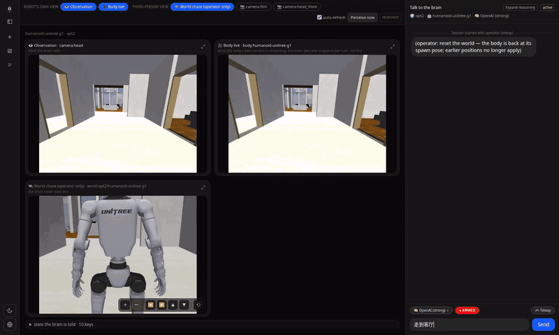
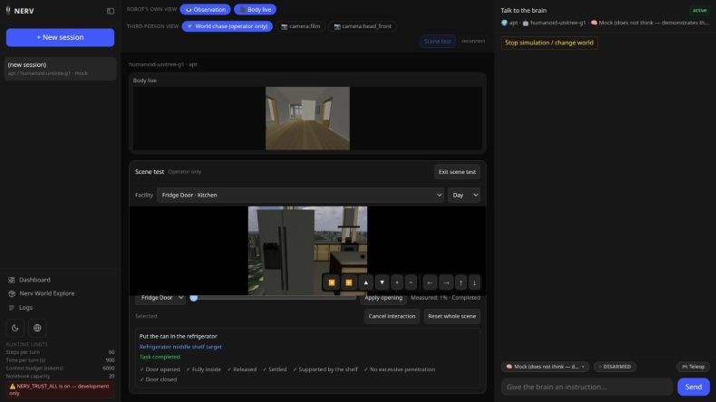
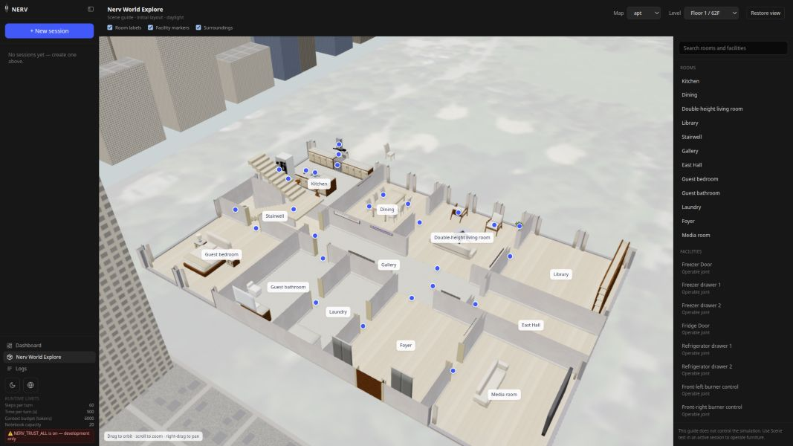

# NERV

[](https://www.python.org)
[](https://modelcontextprotocol.io)
[](https://mujoco.org)
[](https://github.com/huggingface/lerobot)
[](../../../LICENSE)

<a href="../../../README.md"></a>
<a href="README.md"></a>

NERV 将语言模型大脑、机器人身体和仿真或真实环境连接起来，统一管理观测、动作权限和运行记录。

> 🤖 **AI agent 请先阅读 [AGENTS.md](../../../AGENTS.md)**，了解系统分层、配置归属和开发命令。

## 概览

NERV 连接**大脑**、**身体**、**世界**和**工具**。大脑通过插件接入，身体、世界和工具分别运行在独立进程中。平台登记各节点的能力，组装传感观测，检查动作权限与参数，并统一记录运行过程。

大脑决定任务步骤，身体通过自身控制器执行动作，仿真世界计算接触、运动和传感器画面。计算器等工具提供独立能力。身体可以连接仿真总线或硬件驱动；大脑使用相同的接口，不直接读取仿真器中的位置或房间真值。

操作员可以通过独立控制接口测试仿真家具。操作员相机、设施清单和任务真值均不进入大脑的观测与工具列表；场景测试也不改变大脑动作必须经过身体执行的规则。

## 主要特性

- **两套系统、两个时钟**：大脑（System 2）每步推理一次；身体（System 1）以 30–50 Hz 跑一个学出来的策略，跑完一条指令为止，并回报实测结果。二者只在 NERV 里交汇；策略永远不等模型。
- **传感观测与真值分离**：相机和测距仪由所属节点发布。NERV 按会话声明组装大脑观测，拒绝包含仿真位置、房间等真值的输入。
- **会话 = 大脑 × 身体 × 世界**：注册表决定哪些三元组存在；世界没给某个身体备竞技场，就在开始前拒绝。
- **仿真与真机共用动作接口**：一个身体家族统一声明 `move_joints` 等原语和 `move_forward` 等技能，再通过电机总线连接仿真或硬件驱动。
- **大脑是通信协议背后的插件**：Claude、OpenAI 兼容、Ollama 或 mock，跑最简单的看–想–过闸–动循环。NERV 看不到提示词，只看到 `Think`、`CallTool`、`Say`。
- **动作需要人工使能**：每个身体动作都经过权限检查。会话未使能时，动作会被拒绝，大脑收到拒绝原因。
- **场景测试与导览**：操作仿真家具、查看实测任务进度，或在不启动仿真的情况下按楼层浏览建筑与家具模型。
- **运行可追溯、可中断**：观测、推理、指令和总线消息统一记录，技能执行期间可以停止。遵循 NERV/Body 或 NERV/Tool 的进程均可接入，也可通过桥接连接 ROS 系统。

---

## 架构

四种节点、五条接口、一个平台。节点之间互不 import，只靠注册表文件和下面的接口相遇。

<div align="center"></div>

每条接口分为数据平面和控制平面。数据平面提供大脑可以使用的信息与动作；控制平面提供健康检查、启动、重置、真值、操作员视频和使能开关，仅供平台和操作员使用。

| 接口 | 谁和谁 | 数据平面 | 控制平面 |
|---|---|---|---|
| **NERV/Operator** | 人 ⇄ NERV | — | 注册表、会话、聊天与事件流、停止、使能、场景测试、World Explore |
| **NERV/Brain** | NERV ⇄ 大脑插件 | 进：`UserMessage`、`ToolResult`；出：`Think`、`CallTool`、`SetRegister`、`Say` | 加载、能力、用量 |
| **NERV/Body** | NERV ⇄ 身体节点（MCP） | tools = 动词、`nerv://observation`、guidance、config、capabilities | `/health` `/status` `/config`（武装）`/stop` `/hold`（急停）`/release` `/stream` |
| **NERV/World** | 身体 ⇄ 世界（总线）· NERV ⇄ 世界（传感器） | 电机总线；装在世界里的传感器流 | 拉起、`/health`（epoch）、spawn、`/reset`、`/status`、`/stream` |
| **NERV/Tool** | NERV ⇄ 工具节点（MCP） | 只有 tools | `/health` |

<details>
<summary><b>NERV/Operator</b>：HTTP + SSE，由 <code>nerv serve</code> 提供</summary>

`POST /api/sessions {brain, body, world, sensors}` 先做兼容性校验再拉起节点、建会话；`POST /api/sessions/{id}/arm {armed}` 拨武装开关；`POST /api/chat/stream {session, text}` 流式推送 `start · perception · thinking · tool_call · gate · progress · tool_result · reply · done`。节点：`GET /api/nodes`、`/manifest`、`POST …/approve`。注册表：`GET /api/registry` 附兼容矩阵。全表见 [docs/nerv-operator.md](../../nerv-operator.md)。
</details>

<details>
<summary><b>NERV/Brain</b>：消息协议</summary>

大脑获得一个 `Link`，包含 `observe()`、`tools()`、`history()`、`registers()`、`call_tool()`、`set_register()`、`say()` 和 `stop_reason()`。每步决策通过 `Think(text, tool_calls)` 表达，动作权限在 `call_tool` 内检查。人工中断、步数上限和运行时限都可以暂停当前轮次，之后可以继续。寄存器 `set_core_task` 和 `add_note` 保存大脑的工作记忆。见 [docs/nerv-brain.md](../../nerv-brain.md)。
</details>

<details>
<summary><b>NERV/Body</b>：MCP 能力接口与 HTTP 控制接口</summary>

MCP（`/mcp/`）提供工具调用、进度通知、传感观测、操作指引、配置和能力声明。`nerv://observation` 返回状态 JSON 及按 `state.cameras` 命名的图像；`nerv://capabilities` 声明身体家族、工具种类、传感器、使能状态和 epoch。HTTP 控制接口包括 `/health`、`/status`、`/config`、`/stop`、`/hold`、`/release` 和 `/stream`。`/hold` 保持当前关节姿态，机器人跌倒时也会自动进入此状态。`nerv conformance <url>` 按接口契约检查节点。见 [docs/nerv-body.md](../../nerv-body.md)。
</details>

<details>
<summary><b>NERV/World</b>：电机总线与世界传感器</summary>

总线在仿真里是 ZMQ 上的 JSON，在硬件上就是驱动本身：`spawn(joint_names, pd_mode, kp, kd, torque_limit, default_pos)`、`read → {t, joint_pos, joint_vel, imu_quat, imu_gyro, imu_acc, odom_xy, odom_yaw, base_height}`、`write {targets, kp?, kd?}`、`reset`、`sensors`、`sensor(name)`、`rays(angles_deg, max_range_m)`、`epoch`。PD 环住在世界侧（implicit · explicit · position_actuator），理由和它住在舵机固件里一样。世界传感器是 `camera:top` 这样的流，身体的策略按全速率读、NERV 每步读一帧。控制平面：带重启即变的 epoch 的 `/health`、`/status`（真值，给人看）、`/sensors`、`/reset`、`/stream`（跟拍相机）。见 [docs/nerv-world.md](../../nerv-world.md)。
</details>

<details>
<summary><b>NERV/Tool</b>：工具接口</summary>

工具节点提供 MCP 的 `tools/list`、`tools/call` 以及 `/health`。工具函数与身体动作共同出现在大脑的工具列表中；重名时身体动作优先。工具不受身体使能开关约束，但仍经过权限检查并记录日志。见 [docs/nerv-tool.md](../../nerv-tool.md)。
</details>

### 一条指令，两个时钟

<div align="center"></div>

<div align="center"></div>

上图使用早期地图录制，展示一轮完整指令，未剪辑，以 2.5 倍速播放（[原速 MP4](../../media/walk-to-the-living-room.mp4)）。收到“Walk to the living room.”后，gpt-5.5 根据头部相机画面判断前方可能是客厅，连续三次调用 `move_forward`。身体节点的步态策略以 50 Hz 输出关节目标，回报实测移动距离 2.20 m、2.21 m 和 1.20 m。到达门口后，大脑根据高窗、沙发、绿植和木地板判断已经到达客厅。左下角追拍画面只供操作员查看，大脑使用左上角的头部相机观测。

一次交互依次经过观测、决策、权限检查和动作执行。NERV 先组装身体与会话所订阅传感器的观测，大脑据此回答或选择工具。平台检查使能状态、工具权限和参数范围；拒绝原因会作为工具结果返回。通过检查后，身体执行原语或运行技能策略，持续报告进度，最终返回实测距离、受阻或跌倒等结果。大脑再请求观测，决定下一步。

### 原语与技能

| 家族 | 种类 | 动词 | 身体回报什么 |
|---|---|---|---|
| humanoid | 技能 | `move_forward(meters)` | 实测距离、刹车 / 卡住 / 摔倒、前方余量 |
| humanoid | 技能 | `turn_left(degrees)`、`turn_right(degrees)` | 实测转角、漂移 |
| arm | 读 | `read_joints()` | 关节角（°）、夹爪（%） |
| arm | 原语 | `move_joints(targets, duration_s)` | 实测角度、最大误差、被夹限的关节 |
| arm | 原语 | `nudge(joint, delta_deg)` | 实测角度 |
| arm | 原语 | `set_gripper(percent)` | 实测开度 |

原语将关节插值到目标并保持。技能由身体节点运行已发布策略，直到指令完成、超时或被中断。策略在 `bodies/<name>/body.yaml` 的 `skills` 中声明，由身体直接加载；大脑不参与关节控制。

```text
src/nerv/nerve/       五条接口：消息类型、电机总线、传感器流、一致性检查
src/nerv/platform/    注册表、会话、观测组装、路由、安全闸、启动器、信任、HTTP、CLI
src/nerv/brain/       大脑插件：看–想–过闸–动循环、模型供应商、提示词
src/nerv/body/        身体节点：NERV/Body 服务端、技能运行器、家族（humanoid、arm）、总线端点
src/nerv/world/       世界节点：MuJoCo 服务
src/nerv/tool/        工具节点：计算器
bodies/  tools/       注册表                    worlds/  子模块 nerv-world（场景 + 世界描述）
policies/             子模块 nerv-policies      frontend/  网页
```

---

## 安装

```bash
git clone --recurse-submodules https://github.com/Yanshi-Robotics/nerv.git
cd nerv
python3 -m venv .venv && .venv/bin/pip install -e ".[all]"   # 平台、大脑、工具、MuJoCo——一个 venv
cp .env.example .env                                         # API key，或本地 Ollama
.venv/bin/nerv doctor                                        # 配了什么、哪些三元组可行
```

场景源定义与已发布策略通过子模块提供：`worlds/` 是 [nerv-world](https://github.com/Yanshi-Robotics/nerv-world) 子模块（场景库，连同世界描述），`policies/` 是 [nerv-policies](https://github.com/Yanshi-Robotics/nerv-policies) 子模块（已发布的步态策略：`policy.onnx` + `contract.json` + `release.yaml`）。如果 clone 时没带 `--recurse-submodules`，跑一次 `git submodule update --init --recursive`；忘了的话 `nerv doctor` 会提醒。

下载家具和生成的展示模型保存在本机，资产字节不进入 Git。先按[场景资产准备说明](../../../worlds/docs/interactions/README.md#asset-setup)准备家具，再生成两张地图及其可选的 Explore 资源：

```bash
.venv/bin/python -m pip install -r worlds/requirements-explore.txt
.venv/bin/python worlds/tools/make_house.py --scene apt
.venv/bin/python worlds/tools/make_house.py --scene house
.venv/bin/python worlds/tools/export_explore.py --scene apt
.venv/bin/python worlds/tools/export_explore.py --scene house
npm ci --prefix frontend
npm run build:static --prefix frontend
```

Explore 资源位于 `worlds/.cache/explore/{apt,house}/`。修改场景定义或资产后，需要重新生成；资源缺失、过期或被修改时，页面会明确提示。

## 运行

```bash
.venv/bin/nerv chat --world apt --body humanoid-unitree-g1 --brain claude
```

NERV 拉起世界节点，再拉起身体节点和工具，逐个等 `/health`，把身体的自述给你看并请你批准，然后开始对话。输入 `arm` 武装会话（仿真里是安全的），再说「往前走两米、左转，然后告诉我 17 乘 23」。

```text
nerv chat  --world W --body B --brain X      终端里的对话
nerv run   --world W --body B --say "..."    脚本化跑一轮
nerv serve                                   :8000 上的 NERV/Operator API（构建后同时提供网页）
nerv node world|body|tool -- <args>          手动起一个节点，或在另一台机器上起
nerv registry                                大脑、身体、世界、工具、兼容矩阵
nerv conformance URL [--kind body|tool|world]  按接口检查一个节点
nerv doctor                                  配了什么、够不够得着
```

网页（`frontend/`，Next.js）是 NERV/Operator 的一个客户端：`npm ci --prefix frontend` 安装后，运行 `npm run dev --prefix frontend` 在 :8100 开发，或运行 `npm run build:static --prefix frontend` 后交给 `nerv serve` 提供。见下面的[网页](#网页)一节。

### 真机机械臂

`arm-lerobot-so101` 通过 LeRobot 的 `SOFollower` 连接电机。可在当前虚拟环境安装 `pip install -e ".[lerobot]"`，或将 `NERV_LEROBOT_PYTHON` 指向已安装 LeRobot 的环境。在 `.env` 中设置 `SO101_PORT`、`SO101_ID` 和 `SO101_CAMERAS`，再使用 `lerobot-calibrate` 校准。硬件动作同时受 NERV 会话和身体节点的使能开关约束；任一开关关闭时，动作都会被拒绝。操作员须在使能前确认硬件状态，并保持电源开关可及。自主抓取还需要单独训练、发布并验证匹配的策略。

## 网页

<div align="center"></div>

左侧是会话列表，中间显示机器人观测、身体实时相机和操作员追拍画面。追拍相机支持缩放、旋转和俯仰，其画面不会发送给大脑。右侧对话区记录推理、观测、工具调用及权限检查结果；底部提供模型选择和由操作员控制的 **ARMED / DISARMED** 开关。

<div align="center"></div>

**遥控**（Teleop）允许操作员直接调用身体动作，沿用大脑动作的权限检查、节点和日志。操作记录保存在会话中，大脑下一轮可以读取。控件根据节点声明的工具清单生成。**急停**通过关节控制保持当前姿态，不切断电源；跌倒时也会自动触发。**重置整个场景**会取消交互、清除任务进度，并将机器人、家具和道具恢复到初始状态，当前选择的时段保持不变。

**场景测试**允许操作员在当前仿真中测试 apt 的 22 个电器关节、6 把餐椅和 3 个道具，查看实测运动状态，并跟随冰箱收纳任务的判定进度。选择部件时会检查可见表面和两米操作距离。操作员镜头替换追拍画面，机器人头部相机继续显示。进入测试前，机器人先停止运动；退出后须由操作员重新使能。这些操作通过仿真施力完成，不代表 G1 已具备操作家具的技能。

冰箱任务要求罐体完整进入指定冷藏中层，释放后由实体隔板稳定承托，冰箱门关闭，接触穿透保持在容差内。旋钮操作只改变机械状态，不模拟烹饪、水流或温度。

<div align="center"></div>

**Nerv World Explore** 从侧栏打开，无须启动仿真即可浏览 apt 或 house。页面使用从场景导出的建筑和家具模型，支持按楼层查看、搜索房间与设施，以及阅读操作能力和测试方法。画面展示场景的初始设计与白天材质。点击模型只会聚焦视角并显示说明，不会改变运行中的世界。

<div align="center"></div>

house 同样提供早晨、白天、黄昏与夜晚，入口、西侧步道、大门和泳池露台配有夜间照明。G1 会检查真实地面承托与障碍物；遇到缺少承托的落差或超出平地策略能力的地形时停止。

<div align="center"></div>

[验证记录](../../validation/world-explore/README.md)分别列出物理交互、G1 实走、浏览器检查与渲染性能，并保留复现方法及失败案例。

**切换地图**。要让同一机器人在 `apt` 与 `house` 之间切换，请在当前会话或 Dashboard 的身体详情中点击「停止仿真 / 切换地图」并确认。机器人及其仿真世界会一起停止，相关会话转为只读，历史消息和已保存的观测图像继续保留。停止完成后，点击「新建会话」选择目标地图。

<div align="center"></div>

**Dashboard** 显示注册表、在线节点及信任状态。节点声明须经操作员阅读并批准，才会提供给大脑；声明变化后需要重新确认。**Logs** 记录观测、推理、指令和总线消息，支持按会话或查看全部记录。

## 出厂内容

| 身体 | 家族 | 动词 | 传感器 | 总线端点 |
|---|---|---|---|---|
| `humanoid-unitree-g1` | humanoid | 技能 `move_forward`、`turn_left`、`turn_right`（已发布步态策略） | `camera:head`、8 路测距 | 仿真（MuJoCo）· 真机（LeRobot G1 桥，**未验证**） |
| `arm-lerobot-so101` | arm | `read_joints`、`move_joints`、`nudge`、`set_gripper` | `camera:wrist` + 你订阅的任何世界相机 | 仿真（MuJoCo）· 真机（LeRobot `SOFollower`） |

| 世界 | 类型 | 支持 | 世界传感器 |
|---|---|---|---|
| `apt` | 仿真 | `humanoid-unitree-g1`：62—63 层曼哈顿复式、中央公园窗景、操作员家具交互与四时段 | 无 |
| `house` | 仿真 | `humanoid-unitree-g1`：三层加州山坡豪宅、庭院、泳池、封闭宅地边界与四时段 | 无 |

| 工具 | 函数 |
|---|---|
| `calculator` | `calc(expression)`：四则运算、乘方、开方；拒绝非算术表达式 |

机械臂工作台环境尚待开发，计划包含真实工作台及匹配的仿真场景。

G1 使用已发布的平地步态。操作家具、抓取、自主坐下和上下楼仍需额外的机器人技能，场景测试不会赋予 G1 这些能力。

## 添加你自己的

- **大脑**：实现 [NERV/Brain](../../nerv-brain.md) 消息协议。
- **身体**：在 `bodies/` 下提供 `body.yaml` 和 `guidance.md`，声明家族、传感器、策略、执行器和总线端点；也可提供独立的 [NERV/Body](../../nerv-body.md) 服务，通过桥接连接 ROS。
- **世界**：在 `worlds/` 下用 `world.yaml` 声明类型、资产、支持的身体及传感器，或实现独立的 [NERV/World](../../nerv-world.md) 服务。可选的 Explore 配置提供无需启动世界的导览资源。
- **工具**：实现 [NERV/Tool](../../nerv-tool.md) MCP 服务。
- **前端**：通过 [NERV/Operator](../../nerv-operator.md) 使用平台能力。新增身体家族可通过 pull request 提交。

## 致谢

场景来自 [nerv-world](https://github.com/Yanshi-Robotics/nerv-world)。人形的步态策略在 yanshi-rl-lab 里用 Isaac Lab 训练。物理是 [MuJoCo](https://mujoco.org)；硬件接入是 [LeRobot](https://github.com/huggingface/lerobot)；SO-101 模型来自 [TheRobotStudio/SO-ARM100](https://github.com/TheRobotStudio/SO-ARM100)；G1 模型源自 [MuJoCo Menagerie](https://github.com/google-deepmind/mujoco_menagerie)。
