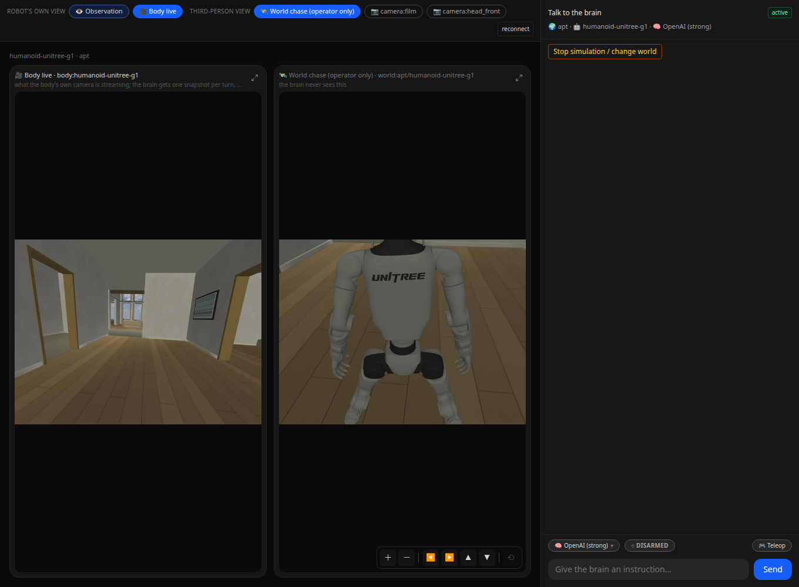
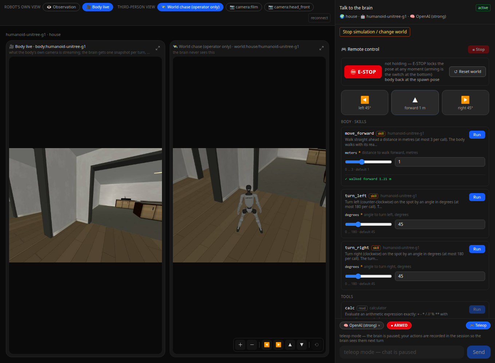
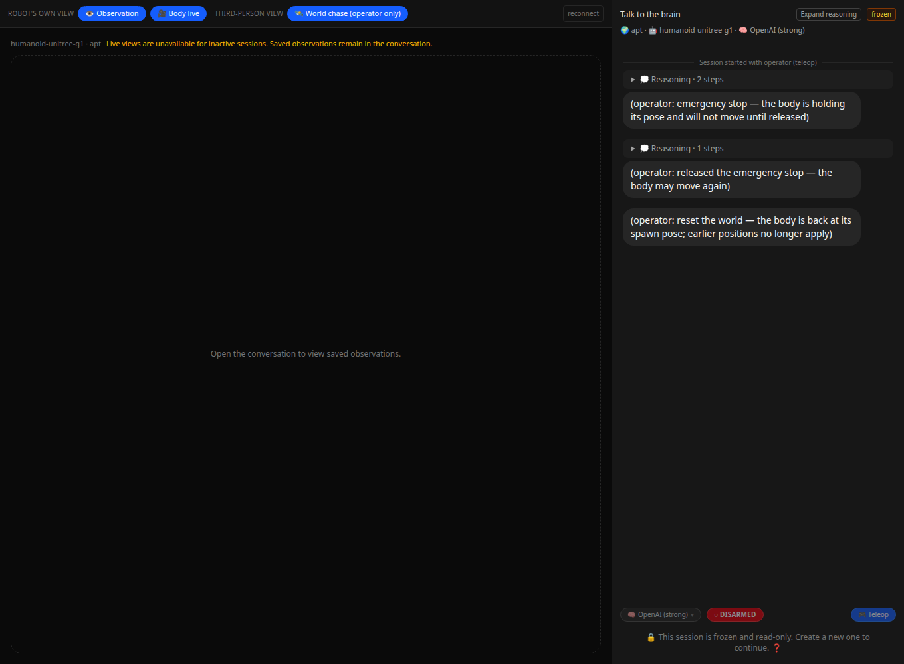

# Residence activation

The resident NERV service was switched to the canonical `apt` and `house` registry on
2026-09-07. Browser acceptance completed the sequence `apt → house → apt`, using the real
G1 simulation, operator controls, and the first-person and chase camera streams. The final
apartment session was left active and disarmed.

## Browser checks

| Check | Result |
|---|---|
| Registry | New-session choices contain `apt` and `house`; retired numbered maps are absent. |
| Apartment motion | Disarmed forward motion was rejected. After arming, the 1 m command reported 1.22 m of measured travel. |
| Mansion motion | The 1 m command reported 1.21 m of measured travel, without falling. |
| Hold and reset | E-STOP held the body; another motion was refused while held. Release and reset succeeded. Reset returned apt to `(4, -6.6)` and house to `(8, -2.7)`, each facing 90°. |
| Map binding | Creating house while the body remained in apt returned HTTP 400 and did not launch a house world. |
| Page switching | Dashboard stopped the apt body and world; the house session view stopped the house pair. The calculator stayed available. New sessions then launched the selected world. |
| Camera controls | Both live views decoded at 640 × 480. Reconnection, expanded view, zoom and orbit controls worked. No browser page errors were recorded. |
| Frozen sessions | Old apt controls returned refusal while house was running; perception returned empty images and state. The frozen page contained no live stream images, emergency controls or simulation-stop button. |
| History | All 11 pre-existing sessions and 22 image hashes were preserved. Only status and arming fields changed where needed; message text, saved observations and epochs were retained. |

These checks used operator teleoperation and did not call a language model. They verify
the local simulation interface, not autonomous navigation, furniture manipulation or hardware.
Geometry, furniture interaction and four-time-of-day checks are recorded separately in the
[scene migration validation](https://github.com/Yanshi-Robotics/nerv-world/blob/master/docs/residences/migration/validation.md).

## Camera performance

Each measurement consumed the resident body's `/stream` and the corresponding world's
`/stream` concurrently for 20 seconds. The browser's live views were closed during the
measurement to keep exactly two continuous stream consumers. JPEG images were decoded and
hashed; the simulated-time increment was divided by wall-clock time. The configured budget
was 640 × 480 at 12 fps. The acceptance thresholds were 10.8 fps per stream and a real-time
ratio of 0.95.

| Scene | First-person fps | Chase fps | Real-time ratio |
|---|---:|---:|---:|
| apt | 11.904 | 11.899 | 1.0002 |
| house | 11.893 | 11.907 | 0.9995 |

The initial apartment run measured 10.615 fps on the body stream. Its loop waited a full
frame period after acquiring each image. The corrected loop includes acquisition and
sending in the period and runs acquisition outside the HTTP event loop. Both scenes then
passed. Exact frame counts, durations and preservation counts are in [metrics.json](metrics.json).
These are short-run measurements on the acceptance host, not a long-duration load test.

## Runtime views

The screenshots show the actual NERV interface. The historical-session sidebar is outside
the captured area.







## Regression checks

The complete Python suite passed with **88 tests**, including the real G1 simulation test.
Ruff, frontend type checking, locale checks and the static frontend build passed.

```bash
.venv/bin/python -m pytest tests -q
.venv/bin/python -m ruff check src tests
npm --prefix frontend run typecheck
npm --prefix frontend run check:locales
npm --prefix frontend run build:static
```

The added regression tests cover local pair shutdown, instance-bound confirmation,
stale-session controls, history preservation, slow-camera responsiveness, and frame pacing.
Source tests are [simulation lifecycle](../../../tests/test_simulation_lifecycle.py) and
[body stream pacing](../../../tests/test_body_stream_pacing.py). The operator's map-switching
procedure is in [NERV/Operator](../../nerv-operator.md#nodes-launched-or-attached).
